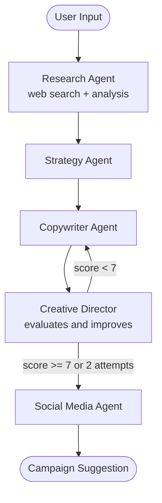

# AI Marketing Agency

[](https://www.python.org/)
[](https://github.com/langchain-ai/langgraph)
[](https://github.com/langchain-ai/langchain)
[](https://agencia-mkt-ia.streamlit.app/)
[](https://agencia-mkt-ia.streamlit.app/)

A study project that demonstrates the use of multi-agent AI systems for marketing idea generation. Given a product or service, the system orchestrates five specialized agents — research, strategy, copywriting, creative review, and social media — to automatically generate campaign suggestions.

> This project does not replace a marketing agency or professional.

The project was built as a functional case study of **agent orchestration with LangGraph and LangChain**, demonstrating shared state, real-time web search, and conditional routing with a review loop.

---

## Access: https://mkto.klauberfischer.online/

Input

```
gaming keyboard
```

Output (5 sections generated automatically)

| Section | Generated content |
|---|---|
| Market Research | Market analysis with real web data |
| Strategy | Target audience, positioning, and channels |
| Content | Posts, captions, and ad copies |
| Creative Review | Improved version with Director's rating |
| Social Media | Hashtags, post ideas, and Reels hooks |

---

## Architecture

The system is an agent graph where each node executes a task and updates a **shared campaign state** (`CampaignState`).

The central point of the architecture is the **review loop**: the Creative Director evaluates the Copywriter's content with a score from 0 to 10. If the score is below 7, the content is sent back to the Copywriter with feedback — up to a maximum of 2 cycles.



---

## Agents

| Agent | Responsibility |
|---|---|
| **Research Agent** | Searches real web data + market, competitor, and trend analysis |
| **Strategy Agent** | Defines target audience, positioning, and channels based on research |
| **Copywriter Agent** | Generates posts, captions, and ad copies — rewrites if it receives Director feedback |
| **Creative Director** | Reviews content, gives a 0–10 score, and decides whether to approve or return |
| **Social Media Agent** | Adapts content for Instagram: hashtags, post ideas, and Reels hooks |

---

## Tools

### `ferramentas/busca_web.py`

Uses **DuckDuckGo Search** (via `langchain-community`) to search for current information about the product before the LLM generates the analysis.

The Research Agent calls this tool with a contextualized query (`"{product} market trends competitors"`) and injects the results into the prompt, grounding the research in real data instead of relying solely on the model's internal knowledge.

No additional API key required.

---

## Tech Stack

| Component | Function |
|---|---|
| **LangGraph** | Agent graph orchestration and conditional routing |
| **LangChain** | LLM and tool integration |
| **OpenAI (gpt-4o-mini)** | Base language model for all agents |
| **DuckDuckGo Search** | Real-time web search for the Research Agent |
| **Streamlit** | Web interface with real-time log streaming |
| **ReportLab** | Campaign export to PDF |

---

## Setup

**1. Clone the repository**

```bash
git clone https://github.com/yourusername/ai-marketing-agency
cd ai-marketing-agency
```

**2. Create and activate a virtual environment**

```bash
python -m venv venv
source venv/bin/activate       # Linux/Mac
venv\Scripts\activate          # Windows
```

**3. Install dependencies**

```bash
pip install -r requirements.txt
```

**4. Configure the API key**

To run locally, create a `.env` file in the project root:

```
OPENAI_API_KEY=your_openai_api_key_here
```

> On Streamlit Cloud, the key is configured via **Secrets** (`Settings → Secrets`), no `.env` needed.

**5. Run**

Web interface:

```bash
streamlit run app/app.py
```

CLI:

```bash
python teste.py
```

Access: `http://localhost:8501`

---

## LangGraph Concepts Demonstrated

- **StateGraph** — typed graph with shared state across all nodes
- **Conditional edges** — dynamic routing based on the Creative Director's score
- **Loop with limit** — the graph can revisit nodes (copywriter ↔ director) controlled by an attempt counter
- **Delta returns** — each agent returns only the keys it modified, not the entire state
- **Streaming** — `graph.stream()` allows displaying progress node-by-node in the UI

---

## Author

Klauber Fischer
