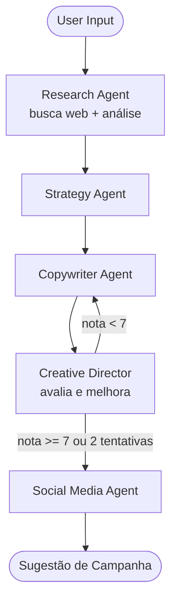

[English version here](README-EN.md)

# AI Marketing Agency

[](https://www.python.org/)
[](https://github.com/langchain-ai/langgraph)
[](https://github.com/langchain-ai/langchain)
[](https://agencia-mkt-ia.streamlit.app/)
[](https://agencia-mkt-ia.streamlit.app/)

Projeto de estudo que demonstra o uso de sistemas multi-agente com IA para geração de ideias de marketing. A partir de um produto ou serviço, o sistema orquestra cinco agentes especializados — pesquisa, estratégia, copywriting, revisão criativa e social media — para gerar sugestões de campanha automaticamente.

> Este projeto não substitui uma agência ou profissional de marketing.

O projeto foi construído como um case funcional de **orquestração de agentes com LangGraph e LangChain**, demonstrando estado compartilhado, busca na web em tempo real, e roteamento condicional com loop de revisão.

---

## Acesse: https://mkto.klauberfischer.online/

Entrada

```
teclado gamer
```

Saída (5 seções geradas automaticamente)

| Seção | Conteúdo gerado |
|---|---|
| Pesquisa de Mercado | Análise de mercado com dados reais da web |
| Estratégia | Público-alvo, posicionamento e canais |
| Conteúdo | Posts, legendas e ad copies |
| Revisão Criativa | Versão aprimorada com nota do Diretor |
| Redes Sociais | Hashtags, ideias de post e hooks para Reels |

---


## Arquitetura

O sistema é um grafo de agentes onde cada nó executa uma tarefa e atualiza um **estado compartilhado da campanha** (`EstadoCampanha`).

O ponto central da arquitetura é o **loop de revisão**: o Diretor Criativo avalia o conteúdo do Copywriter com uma nota de 0 a 10. Se a nota for menor que 7, o conteúdo retorna ao Copywriter com o feedback — até no máximo 2 ciclos.



---

## Agentes

| Agente | Responsabilidade |
|---|---|
| **Research Agent** | Busca dados reais na web + análise de mercado, concorrentes e tendências |
| **Strategy Agent** | Define público-alvo, posicionamento e canais com base na pesquisa |
| **Copywriter Agent** | Gera posts, legendas e ad copies — reescreve se receber feedback do Diretor |
| **Creative Director** | Revisa o conteúdo, dá uma nota de 0–10 e decide se aprova ou devolve |
| **Social Media Agent** | Adapta o conteúdo para Instagram: hashtags, ideias de post e hooks para Reels |

---

## Ferramentas

### `ferramentas/busca_web.py`

Utiliza **DuckDuckGo Search** (via `langchain-community`) para buscar informações atuais sobre o produto antes de o LLM gerar a análise.

O Research Agent chama essa ferramenta com uma query contextualizada (`"{produto} mercado tendências concorrentes"`) e injeta os resultados no prompt, fundamentando a pesquisa em dados reais em vez de depender apenas do conhecimento interno do modelo.

Não requer chave de API adicional.

---

## Tech Stack

| Componente | Função |
|---|---|
| **LangGraph** | Orquestração do grafo de agentes e roteamento condicional |
| **LangChain** | Integração com LLM e ferramentas |
| **OpenAI (gpt-4o-mini)** | Modelo de linguagem base de todos os agentes |
| **DuckDuckGo Search** | Busca na web em tempo real para o Research Agent |
| **Streamlit** | Interface web com streaming dos logs em tempo real |
| **ReportLab** | Exportação da campanha em PDF |

---

## Setup

**1. Clone o repositório**

```bash
git clone https://github.com/yourusername/ai-marketing-agency
cd ai-marketing-agency
```

**2. Crie e ative um ambiente virtual**

```bash
python -m venv venv
source venv/bin/activate       # Linux/Mac
venv\Scripts\activate          # Windows
```

**3. Instale as dependências**

```bash
pip install -r requirements.txt
```

**4. Configure a chave da API**

Para rodar localmente, crie um arquivo `.env` na raiz do projeto:

```
OPENAI_API_KEY=your_openai_api_key_here
```

> No Streamlit Cloud, a chave é configurada via **Secrets** (`Settings → Secrets`), sem necessidade de `.env`.

**5. Execute**

Interface web:

```bash
streamlit run app/app.py
```

CLI:

```bash
python teste.py
```

Acesse: `http://localhost:8501`

---

## Conceitos LangGraph demonstrados

- **StateGraph** — grafo tipado com estado compartilhado entre todos os nós
- **Conditional edges** — roteamento dinâmico baseado na nota do Diretor Criativo
- **Loop com limite** — o grafo pode revisitar nós (copywriter ↔ diretor) controlado por contador de tentativas
- **Delta returns** — cada agente retorna apenas as chaves que modificou, não o estado inteiro
- **Streaming** — `grafo.stream()` permite exibir o progresso nó a nó na UI

---

## Autor

Klauber Fischer
